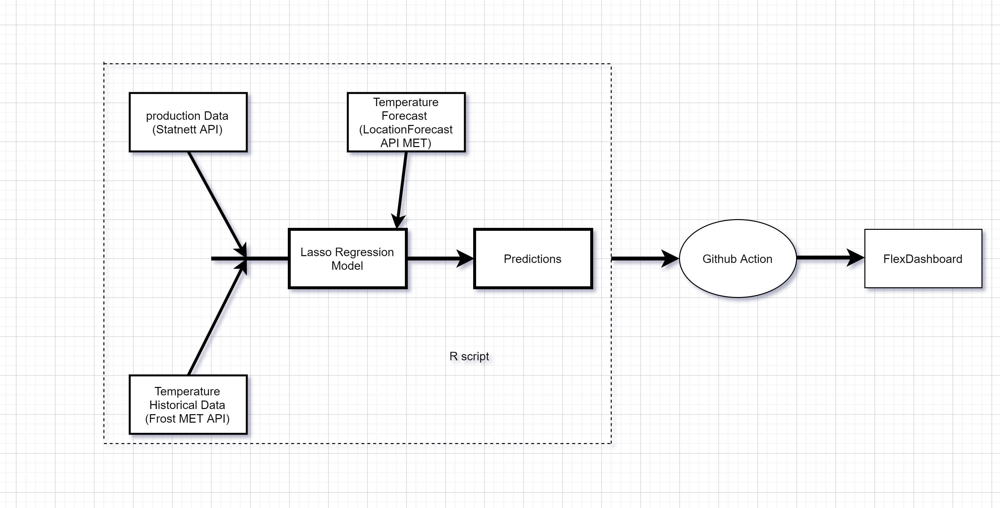

```{r setup, include=FALSE}
library(flexdashboard)
```

Monitoring
=======================================================================

Row {data-height=350  data-width=700}
-----------------------------------------------------------------------


##

```{r , fig.width=15, fig.height=4}
library(rjson)
library(xts)
library(dplyr)
library(dygraphs)
library(tidyr)
library(dplyr)
library(lubridate)
library(glmnet)
library(weatherr)


data_url <- paste0("http://driftsdata.statnett.no/restapi/ProductionConsumption/GetData?From=", as.Date("2020-04-1"))

data_request <- httr::GET(url = data_url, httr::user_agent("https://github.com/krose/statnettapi"))

  data_content <- httr::content(data_request, as = "text", encoding = "UTF-8")
  data_content <- jsonlite::fromJSON(data_content)

 

Production = data_content$Production
consumption = data_content$Consumption

date_utc <- seq(from = data_content$StartPointUTC,
                  to = data_content$EndPointUTC,
                  by = data_content$PeriodTickMs) / 1000

  date_utc <- lubridate::as_datetime(date_utc)

x = data.frame(date_utc=date_utc, Production=Production,consumption=consumption)

library(lubridate)
x$date_utc = ymd_hms(x$date_utc)
x$date = date(x$date_utc)
x$date = x$date + 1 #fixing the date in the data 
x = filter(x,date != max(date))#removing last date since it reports wrongly


data_selection = dplyr::select(x,Production,consumption) 

data_selection$border1 = data_selection$Production
data_selection$border2 = data_selection$consumption


#data_selection = scale(as.matrix(data_selection))
                       
                       

calnder_date = x$date 

ts <- xts( data_selection, order.by= calnder_date)


dygraph(ts, main = "Norwegian Production and Consumption of Electrcity")%>%
  dyRangeSelector() %>%
  dySeries("consumption") %>%
  dySeries(c("border2", "Production" , "border1")) %>%
  dyLegend(show = "always",width = 400)
```


<br>
<br>
<br>


Row {data-height=350  data-width=700}
-----------------------------------------------------------------------

##

```{r , fig.width=15, fig.height=4}
system_date = Sys.Date()
#system_date

referenceTime = paste ("2020-04-1",system_date, sep = "/", collapse = NULL)
#referenceTime


# Insert your own client ID here
#<>
client_id = 'b313ad09-293a-49c7-a68b-19688ff2167d'

#rjson::fromJSON(file = url)

# Define andpoint and parameters
endpoint <- paste0("https://",'b313ad09-293a-49c7-a68b-19688ff2167d', "@frost.met.no/observations/v0.jsonld")

sources <- 'SN18269'  #oslo station

elements <- 'min(air_temperature P1D)'

system_date = Sys.Date()

#referenceTime <- '2020-04-1/2020-07-02'

# Build the URL to Frost
url <- paste0(
    endpoint, "?",
    "sources=", sources,
    "&referencetime=", referenceTime,
    "&elements=", elements
)
# Issue an HTTP GET request and extract JSON data

xs <- try(jsonlite::fromJSON(URLencode(url),flatten=T))

# Check if the request worked, print out any errors
if (class(xs) != 'try-error') {
    df <- unnest(xs$data)
    #print("Data retrieved from frost.met.no!")
} else {
    #print("Error: the data retrieval was not successful!")
}


fair_weather = df %>% select(referenceTime,value)%>% group_by(referenceTime)%>% summarize(temprature = min(value))
fair_weather$date = ymd_hms(fair_weather$referenceTime)
fair_weather$date = date(fair_weather$date)
data = x %>%  left_join(fair_weather,by = c( "date"="date"))

data$consumption_lag_5_day =lag(data$consumption,5)
#data$consumption_lag_one_week =lag(data$consumption,7)
data$week_day =weekdays(data$date)


data = data[complete.cases(data), ]

y_train <- data$consumption


#x_train <-   data %>% select(temprature,consumption_lag_one_day,consumption_lag_one_week,week_day)

x_train <-   data %>% select(temprature,consumption_lag_5_day,week_day)


x_train = model.matrix(~.,  x_train)


cv <- cv.glmnet(x_train,y_train , alpha = 1)


lasso_model <- glmnet(x_train, y_train, alpha = 1, lambda = cv$lambda.min)


x_train$Lasso_prediction = predict(lasso_model,x_train)
#cor(x_train$Lasso_prediction,y_train)

x_train$percentage_error = (abs(y_train- x_train$Lasso_prediction)/ y_train)+.0001

 

#MAPE
#average_percentage_error_test  = sum(x_train$percentage_error) / nrow(x_train$percentage_error)

#average_percentage_error_test


temperature = data$temprature
prediction = x_train$Lasso_prediction
conumsption = y_train

data_selection = as.data.frame(cbind(conumsption,temperature))
names(data_selection)[names(data_selection) == 's0'] <- 'prediction'
#nrow(data_selection)  
#str(data_selection)
                       

calnder_date = data$date 
#nrow(data$date)
ts <- xts( data_selection, order.by= calnder_date)


dygraph(ts, main = "Norwegian Consumption of Electricity Vs Temperature")%>%
  dyRangeSelector() %>%
  dySeries("conumsption") %>%
  dySeries("temperature", axis = 'y2') %>%
  dyLegend(show = "always",width = 400)%>%
  dyHighlight(highlightCircleSize = 5, 
              highlightSeriesBackgroundAlpha = 0.2,
              hideOnMouseOut = FALSE)


```

Prediction
=======================================================================

Row  {data-height=600  data-width=700}
-----------------------------------------------------------------------

<br>
<br>
<br>
```{r , fig.width=15, fig.height=5}
#weather_forecast <- rjson:::fromJSON(file="https://api.met.no/weatherapi/locationforecast/2.0/complete?lat=-16.516667&lon=-68.166667&altitude=4150")

#weather_forecast = as.data.frame(weather_forecast)


forecast = locationforecast(lat=59.9507961968,lon=10.9051997125,exact=FALSE)
forecast = forecast[complete.cases(forecast), ]

forecast$timeto = ymd_hms(forecast$timeto)
forecast$date = date(forecast$timeto)
forecast = forecast %>% group_by(date)%>% summarise(temprature = min(minTemperature))
forecast$week_day = weekdays(forecast$date)

data_etl = data %>% select (date,temprature,week_day,consumption)
data_etl = dplyr::bind_rows(data_etl, forecast)
data_etl$consumption_lag_5_day = lag(data_etl$consumption,5)

  x_test <-   data_etl %>% select(temprature,consumption_lag_5_day,week_day,date)
#x_test = x_test[complete.cases(x_test), ]


x_test[is.na(x_test)] <- 0


x_test_model <-   x_test %>% select(temprature,consumption_lag_5_day,week_day)

x_test_model = model.matrix(~.,  x_test_model)
#%>% filter(date >= system_date)


x_test$Lasso_prediction = predict(lasso_model,x_test_model)


temperature = x_test$temprature
prediction = x_test$Lasso_prediction
date = x_test$date


data_selection = as.data.frame(cbind(prediction,temperature))
data_selection$date = date


names(data_selection)[names(data_selection) == 's0'] <- 'prediction'
#data_selection$date =  as_date(data_selection$date)


#str(lubridate::today())
data_selection = data_selection %>% dplyr::filter(date>= system_date ) %>% dplyr::filter(date<= system_date+5 )
#as.Date


 
calnder_date = data_selection$date
ts <- xts( data_selection, order.by= calnder_date)


dygraph(ts, main = "Consumption prediction for the next 5 days")%>%
  dyRangeSelector() %>%
  dySeries("prediction") %>%
  dySeries("temperature", axis = 'y2') %>%
  dyLegend(show = "always",width = 400)%>%
  dyHighlight(highlightCircleSize = 5, 
              highlightSeriesBackgroundAlpha = 0.2,
              hideOnMouseOut = FALSE)
```
<br>
<br>
<br>

About
=======================================================================

Row  {data-height=600  data-width=700}
-----------------------------------------------------------------------

<br>
<br>
<br>

* The goal of this dashboard is to present an end to end data science project using R in production with the help of open source tools. 
<br>
* The focus of the project is on the engineering part rather than the accuracy of the prediction model.
<br>
* The model predicts the daily consumption for whole Norway 5 days ahead in time. 
<br>
* The model is trained using temperature data for Oslo area and historical production levels.
<br>
* The model is trained and produce predictions every day using Github action

<br>
<br>

Row  {data-height=600  data-width=700}
-----------------------------------------------------------------------

## System Architecture

<br>
<br>

{width=50%}

